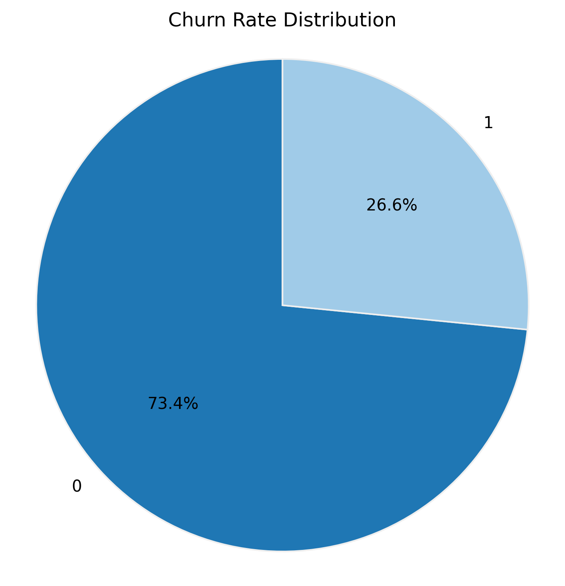
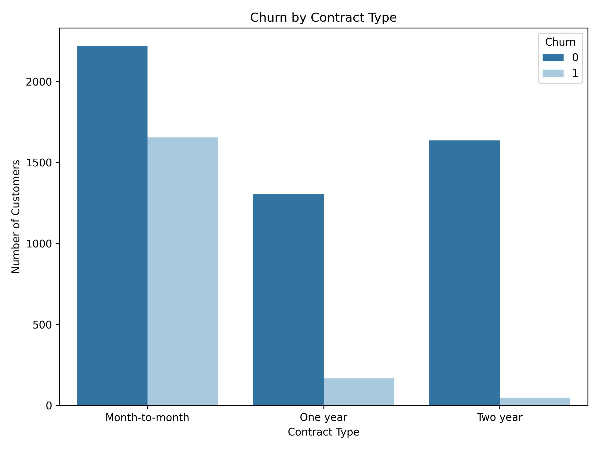
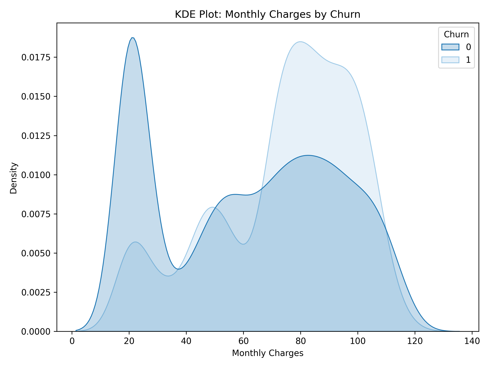
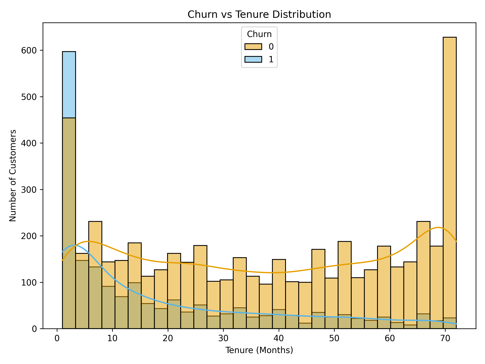
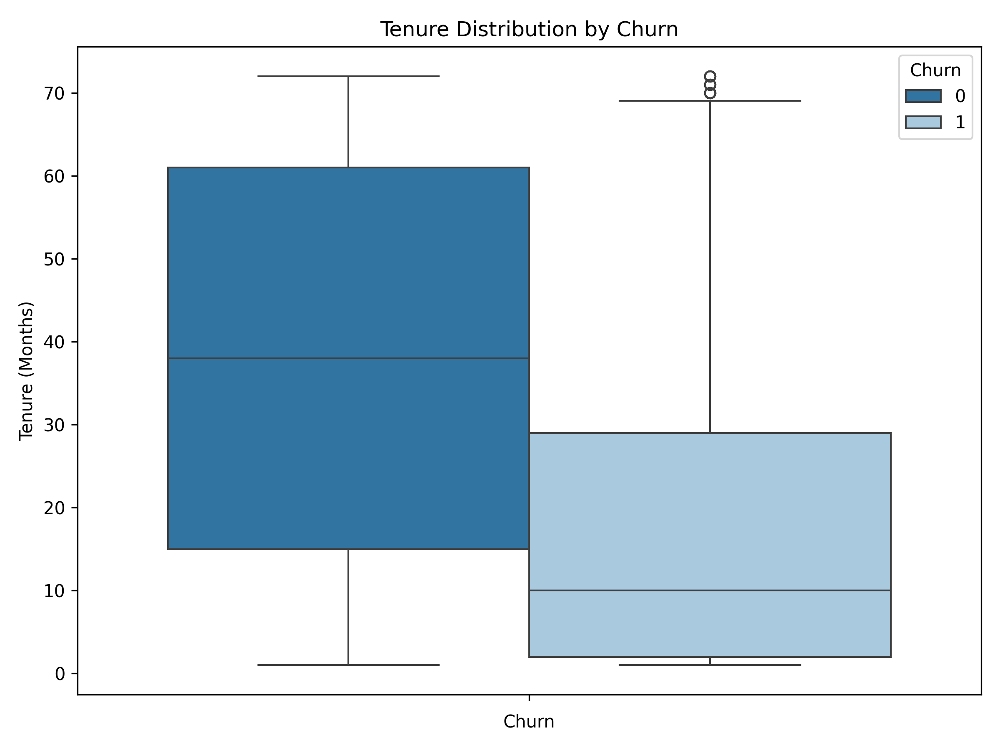

# 📊 Telco Customer Churn Analysis

This project analyzes customer churn behavior for a telecom company using the [Telco Customer Churn dataset](https://www.kaggle.com/datasets/blastchar/telco-customer-churn).  
The goal is to identify key drivers of churn and visualize insights to help the business reduce customer loss.

---

## 🧠 Objective

- Understand factors that contribute to customer churn
- Identify high-risk customer segments
- Build an interactive Power BI dashboard
- Optionally apply machine learning to predict churn

---

## 🧼 Data Cleaning

- Converted `Yes/No` values to `1/0` for binary columns
- Handled missing values in `TotalCharges`
- Created features like `AvgMonthlySpend`, `HasMultipleServices`
- One-hot encoded categorical features for modeling

---

## 📊 Exploratory Data Analysis

Key questions explored:

- What is the overall churn rate?
- How does churn vary by contract type, payment method, and tenure?
- Do service usage and demographics impact churn?

### 🔍 Sample Visualizations

  <b>Churn Distribution</b>
   
  

  <b>Churn by Contract Type</b>
   
  

  <b>Monthly Charges by Churn</b>
   
  

  <b>Churn Tenure Histogram</b>
   
  

  <b>Churn Tenure Boxplot</b>
   
  

 

> ℹ️ All visualizations created using Seaborn and Matplotlib.
